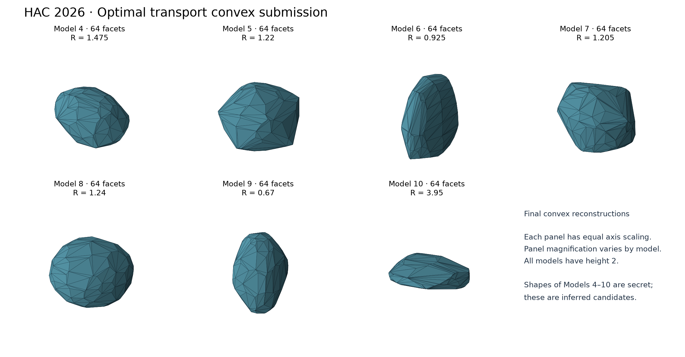

# Optimal transport convex reconstruction — HAC 2026

Submission by the Rice University team for the [Helsinki Asteroid Challenge 2026](https://fips.fi/data-challenges/helsinki-asteroid-challenge-2026/).
We reconstruct a convex shape from lightcurve data using a modification of the classical methods developed by Kaasalainen, Torppa, Ďurech and others.

In particular, our approach integrates techniques from computational optimal transport to reconstruct a continuous surface measure on a sphere, then convert it to a mixture of Diracs corresponding to a convex polyhedron.

A preliminary explanation of our approach can be found in [docs/method.pdf](docs/method.pdf). 
**That document was generated by an LLM.**
None of us like reading LLM-generated text. 
A human-authored replacement is forthcoming.

## LLM-usage statement

We used LLMs extensively during the course of this project, including to generate text, code, and this README. 
We did not always check the outputs carefully. 

## Install

Python 3.12 is the tested interpreter. Python 3.11–3.13 is declared supported;
numerical dependencies are pinned in `pyproject.toml`.

```sh
python3.12 -m venv .venv
source .venv/bin/activate
python -m pip install .
python -m unittest discover -s tests -v
```

## Obtain the observations

Download the released data from the
[official challenge page](https://fips.fi/data-challenges/helsinki-asteroid-challenge-2026/).
The algorithm uses only the real-intensity lightcurve tables, acquisition
geometry, and released cylinder radii. Reference shapes and videos are not
inputs. The data itself is not included in Git.

Import the tables from the downloaded folder or ZIP:

```sh
python scripts/prepare_data.py /path/to/downloaded/HAC-data
# A downloaded ZIP is also accepted as the source argument.
```

The importer copies only the ten required tables into ignored `data/` and
checks every byte against `data_manifest/real_intensity_20260907.json`.
It accepts the current Model-1 release, includes Model 10's unusual
`Asteroid010` filename, and refuses to overwrite different existing data.
For a subset, add `--models 1,2,3` or `--models 4,5,6,7,8,9,10`.

## Reproduce the public controls

Run all commands below from the repository root with the environment active.
Output directories must be new; completed or failed runs are never silently
overwritten.

```sh
python -m hac_forward.reconstruct --data-dir data --models 1,2,3 \
  --config configs/submission.json --output-dir runs/public
python scripts/check_public_regression.py --run-dir runs/public \
  --output runs/public/regression_receipt.json
```

The regression fixture contains our previously calibrated reconstructions
and predictions, not the organizers' reference meshes. It checks coefficients,
surface-area masses, predictions and exported geometry. Byte equality is
reported separately from the numerical acceptance tolerance, since numerical
libraries and platforms can affect the last few digits.

For optional official scores against the public reference shapes, see
[evaluation/README.md](evaluation/README.md). That path loads the organizers'
unchanged, checksum-verified Python/MATLAB sources from a separate download.

## Reconstruct and package the seven challenge models

```sh
python -m hac_forward.reconstruct --data-dir data --models 4,5,6,7,8,9,10 \
  --config configs/submission.json --output-dir runs/secret
python -m hac_forward.package --run-dir runs/secret \
  --config configs/submission.json --output-dir results
```

Each model directory records its full effective configuration, input and
source hashes, runtime, seeds, dense and reduced surface-area distributions,
intrinsic/final meshes, solver diagnostics, and replayed brightness curves.
The seven submission files are named `AsteroidModel04.stl` through
`AsteroidModel10.stl`. The package includes a manifest, per-model geometry
certificates, and `SHA256SUMS`.



The optional preview can be regenerated with
`python -m pip install '.[visualization]'` followed by
`python scripts/plot_results.py`. Plotting is separate from inference.

Packaging requires all seven complete runs from the current source and frozen
configuration. It rechecks the recorded artifacts and the actual serialized
STLs. A numerical failure is recorded in `run.json` and stops the command;
there is no silent replacement shape or model-specific hand editing.

## Algorithm and parameter policy

We fit a positive distribution of surface area over outward unit normals,
with total mass one and zero vector moment. A normalized facet-brightness
model connects this distribution to the observations. The objective combines
the lightcurve residual, a debiased Sinkhorn transport penalty to a spheroidal
reference, and a second-moment penalty. Spherical optimal transport reduces
the distribution to a small set of facets while preserving closure. A
variational Minkowski solver realizes those facet normals and areas as a
convex polyhedron.

The emitted mesh is centered at its volume centroid, centered vertically,
scaled to touch `z=-1` and `z=1`, and scaled horizontally about the fixed origin
to touch the released cylinder. The corresponding changes in normals and
surface areas are accounted for when replaying its brightness. The light
direction is `(-1,0,0)`; no post-fit rotation is applied.

For this release, `configs/submission.json` uses **lambda_W=0.03**, a requested
**64-facet budget**, and a minimum normalized facet mass of **1e-8**. Very small
facets can be merged, so the actual count may be smaller. There is no sparse
mass refitting. All effective settings, including calibration, seeds, and
solver tolerances, are explicit. The active scattering kernel is the
Lambert coefficient 100 plus Lommel–Seeliger coefficient 1 in
`phase1.shape`; the older renderer labels retained in the calibration record
do not define this kernel.

Per-model hyperparameters are permissible. We assessed a fixed input-only
L-curve rule on the available public grid; it showed nonmonotone or weak
corners and did not justify replacing this preset. See
[the assessment](calibration/parameter_selection/README.md). These public
examples were also used during method development, so the results are
calibration evidence, not an independent estimate of secret-model accuracy.

## Validation and limitations

The public calibration's mean positive voxel/projection scores are
**0.861174 / 0.969775** (combined **1.830949 out of 2**). Those values use
the released examples' voxel pitch 0.05 and MATLAB angle 0 degrees. The
released MATLAB code measures an XY silhouette; its angle rotates the raster
in that plane. Final leaderboard evaluation settings have not been specified.

The package checks finite nondegenerate triangles, watertight manifold
topology, orientation, connectivity, positive volume, and the challenge frame.
An independently checked numerical certificate establishes that the triangles
cover their convex-hull boundary once, using supporting planes, outward
orientation, area/volume agreement, Euler characteristic, and vertex links.
It reports its tolerances and does not resolve geometric defects below that
scale. It is a sufficient check for convex outputs, not an exact-predicate
intersection algorithm for arbitrary meshes.

We also require facet-area realization accuracy and agreement between
brightness computed from the transformed area distribution and from the
serialized STL triangles. A good brightness fit alone does not establish a
correct shape. Convex reconstruction cannot represent concavities, and the
full optimization problem is not globally convex.

## Repository scope and license

This is a new, focused Git history containing the submitted method and its
evidence. Historical experiments, videos, raw challenge data, and working
environments are excluded. `provenance/source_extraction.json` records the
preserved numerical symbols from the research implementation.

Project code is **GPL-3.0-or-later**; see [LICENSE](LICENSE) and
[THIRD_PARTY_NOTICES.md](THIRD_PARTY_NOTICES.md).
